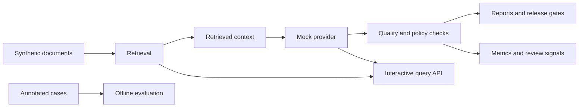

# LLMOps Workbench


*An inspectable environment for evaluating, serving, and monitoring production-style LLM systems.*

**[Open the live workbench](https://llmops-workbench-3auiyr3neq-ew.a.run.app)**

The workbench combines a synthetic RAG application with offline evaluation, live quality signals, safety checks, observability, and controlled delivery. It uses synthetic data and deterministic model responses, so the complete lifecycle can be inspected without confidential data or paid APIs.

## What is LLMOps and why it matters

An LLM application combines a model with prompts, retrieved context, evaluation data, policies, provider configuration, and runtime infrastructure. Each component can change independently and affect quality beyond the reach of conventional uptime and error-rate checks.

**LLMOps is the engineering discipline for managing that lifecycle.** It applies repeatable evaluation, release controls, monitoring, safety checks, and operational feedback to LLM systems so teams can answer practical questions:

- Did the candidate version improve or regress on known cases?
- Is a response supported by the retrieved evidence?
- Are policy and output-contract failures visible?
- Can a release be reproduced, observed, and rolled back?
- Can uncertain production behavior become a future regression test?

*These practices make probabilistic behavior measurable, reviewable, and safer to change.*

## LLMOps Pillars in This Workbench

| Pillar | What it means | Implementation in this repository |
| --- | --- | --- |
| **Evaluation** | Measure quality before release against explicit expectations. | A versioned 30-case benchmark, six transparent evaluators, thresholds, and generated reports. |
| **Retrieval quality** | Measure the context selection that shapes generated answers. | Local TF-IDF retrieval, expected-source labels, retrieval F1, confidence signals, and visible citations. |
| **Runtime observability** | Inspect behavior after release while labeling proxy signals precisely. | Request traces, latency histograms, Prometheus-style metrics, rolling live checks, and review signals. |
| **Safety and governance** | Encode policy behavior, refusals, data boundaries, and review paths. | Unsafe-request routing, policy checks, synthetic data, explicit privacy constraints, and case-study documentation. |
| **Reproducibility** | Make evaluation and delivery stable enough to compare changes. | Deterministic mock generation, versioned datasets, isolated modules, tests, containers, and CI gates. |
| **Controlled delivery** | Connect quality checks to deployment while limiting operational risk. | Automated Google Cloud Run deployment from `main` after the CI checks pass. |

*This compact implementation covers a deliberate subset of production concerns.* Larger systems commonly add semantic judges, human review operations, experiment tracking, prompt and model registries, distributed tracing, persisted run history, and provider-specific telemetry.

## Explore the Workbench

- [`/app`](https://llmops-workbench-3auiyr3neq-ew.a.run.app/app) — query a synthetic operational corpus and inspect cited retrieval evidence.
- [`/ops`](https://llmops-workbench-3auiyr3neq-ew.a.run.app/ops) — compare offline quality gates with live request diagnostics.
- [`/case-studies`](https://llmops-workbench-3auiyr3neq-ew.a.run.app/case-studies) — connect broader engineering patterns to the implementation.

**The mock provider is intentional.** It keeps evaluation reproducible, removes API costs, and prevents the public endpoint from generating model charges. Provider boundaries support future integrations.

## Evaluation Model

**The workbench keeps labeled offline evaluation separate from unlabeled runtime diagnostics.**

### Offline benchmark

Thirty synthetic cases define expected sources, support terms, actions, output contracts, prompt families, perturbations, and risk tags. Retrieval F1, citation support, answer grounding, balanced policy accuracy, format compliance, and paired robustness each expose their denominator and pass threshold.

The benchmark snapshot is returned by `GET /evaluation/offline`. Dataset metadata is available from `GET /evaluation/dataset`.

### Live diagnostics

Interactive requests are checked without reference answers. The system measures evidence overlap, citation validity, retrieval confidence, policy consistency, and response-contract compliance. These diagnostic proxies support operational review. **Factual accuracy and retrieval recall require labeled reference data.**

Rolling results are available from `GET /evaluation/live`. Weak signals identify requests for review and possible promotion into future annotated regression cases.

The evaluators provide transparent baseline signals. A production evaluation program also needs human review, semantic judges, red teaming, and provider telemetry.

## System Design



Retrieval, providers, evaluators, reporting, observability, and API delivery are separate modules so each boundary can be inspected or replaced independently.

## Project Layout

```text
llmops_workbench/             Python package and FastAPI backend
frontend/                     Static customer app and engineering console
datasets/ground_truth/        Versioned annotated benchmark
examples/synthetic_docs/      Synthetic RAG corpus
examples/evaluation_sets/     Compact evaluator fixtures
docs/                         Architecture notes and case studies
scripts/                      Evaluation, reporting, deployment, and build utilities
tests/                        Deterministic application tests
```

<details>
<summary><strong>Run locally</strong></summary>

Requirements: Python 3.11 or later, Poetry, and Make.

```bash
poetry config virtualenvs.in-project false --local
poetry config virtualenvs.path .venvs --local
make install
make demo
make test
make api
```

Open `http://127.0.0.1:8000`, or query the API:

```bash
curl -s -X POST http://127.0.0.1:8000/query \
  -H "Content-Type: application/json" \
  -d '{"query": "How should a deployment rollback be handled?", "top_k": 3}'
```

The static frontend is served by FastAPI and requires no separate Node.js build.

</details>

<details>
<summary><strong>Google Cloud Run deployment</strong></summary>

The hosted instance is deployed on Google Cloud Run. When repository delivery is enabled, pushes to `main` deploy automatically after the CI checks pass.

The public service limits request bodies and request rates, omits submitted prompts from telemetry, disables mutation and API-discovery endpoints, and runs as a non-root container with a dedicated runtime identity.

Deployment requires a pre-provisioned runtime service account and a deployer allowed to use it. CI reads that identity from repository configuration; the manual helper accepts it explicitly as `./scripts/deploy_cloud_run.sh PROJECT_ID RUNTIME_SERVICE_ACCOUNT [REGION]`.

</details>

## Data and Privacy

**All application content is synthetic or sanitized.** The repository contains no customer or employer data, private prompts or traces, exact internal system designs, real provider calls in the default configuration, or committed secrets.

See [docs/confidentiality.md](docs/confidentiality.md) for the complete privacy posture.

## Source License

**This is proprietary, source-available software.** Public access permits viewing and personal evaluation only. Copying, modification, redistribution, commercial use, production use, and offering it as a service require prior written permission. See [LICENSE](LICENSE) for the full terms. Third-party components remain subject to their own licenses.

## Planned Extensions

- Optional OpenTelemetry traces and spans.
- Persisted run history and baseline-to-candidate comparisons.
- Real provider adapters guarded by explicit configuration and test doubles.
- Mutation-style checks for prompt injection and citation drift.
- CI quality gates for evaluation regressions.
