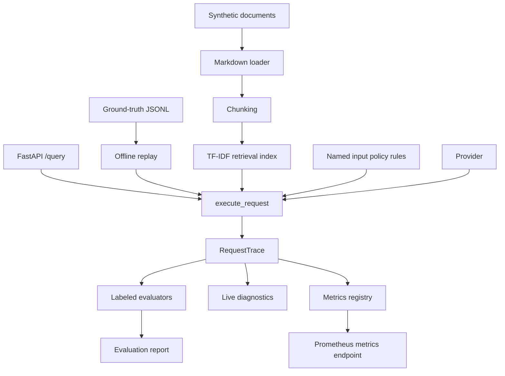

# Architecture

This repository implements a representative LLMOps evaluation and RAG observability workflow with local-first components.

## Design Principles

- **Privacy-safe:** all data is synthetic or sanitized.
- **Local-first:** the default path requires no paid APIs and no network calls.
- **Transparent:** evaluation heuristics are simple, inspectable, and deterministic.
- **Composable:** retrieval, providers, evaluators, reporting, and API layers are separated.
- **Operationally credible:** the demo includes reports, metrics, latency tracking, and quality gates that mirror production concerns.

## Unifying Abstraction

Every request is one canonical trace. Live HTTP traffic and offline dataset replay run through the same `execute_request()` pipeline in `llmops_workbench/execution.py` and emit the same `RequestTrace` schema. Retrieval evidence, the rendered prompt, generation, guardrail verdicts, timings, token usage, and the pinned run configuration all belong to that trace; evaluation, observability, and governance read traces instead of maintaining parallel request representations.

Input policy is a set of named rules in `llmops_workbench/policy.py`. Each rule names one harmful capability and is decided inside a single clause: a bare imperative refuses, as does a nearby preceding phrase asking how to carry the action out or asking for protected material to be handed over, while defensive framing such as "prevent" or "detect" does not. A question about unsafe behavior is therefore answered, and a request for one is refused before any provider call. Every trace records which rules fired.

Planned, not yet implemented: a single comparison engine that runs configuration X and configuration Y over the same versioned dataset and reports per-dimension changes with uncertainty. CI will use it headlessly against a committed baseline, while the static Ops console will expose the same result schema for prompt A/B inspection.

The hosted Cloud Run service remains deterministic and mock-only. Current external-provider selections are non-networking placeholders. Any future real-provider access will be a local, explicit opt-in because a public paid-model endpoint would create uncontrolled cost and prompt-injection exposure.

## Scope Boundaries

The workbench is a portfolio demonstration, not a production serving platform. Production availability, deep retrieval, Kubernetes orchestration, multi-tenancy, and authentication or authorization are explicit non-goals. Related case studies describe wider industry patterns without claiming those capabilities are implemented here.

## Runtime Flow

1. Synthetic Markdown documents are loaded from `examples/synthetic_docs/`.
2. The documents are chunked and indexed with scikit-learn TF-IDF.
3. Labeled evaluation cases are loaded from `datasets/ground_truth/`.
4. `execute_request()` applies the named input policy, retrieves context, renders the prompt, calls the provider, and returns one `RequestTrace`. A refused request short-circuits generation and records no provider token usage.
5. Labeled evaluators read traces to score retrieval overlap, citation support, grounding, policy decisions, format contracts, and robustness. Live diagnostics read the same traces without reference answers.
6. Reports are written to `reports/evaluation_report.json` and `reports/evaluation_report.md`.
7. `POST /query` returns the answer together with the `trace_id` and `config_id` of the same trace.
