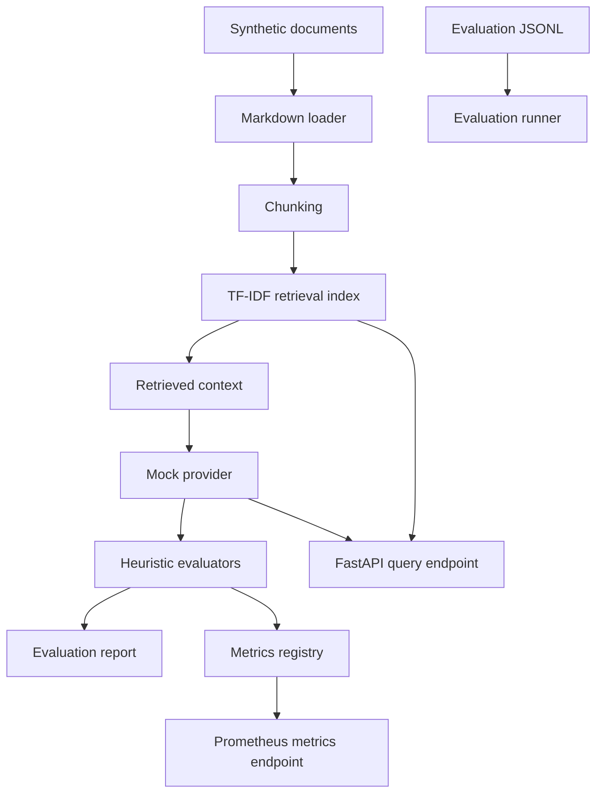

# Architecture

This repository implements a representative LLMOps evaluation and RAG observability workflow with local-first components.

## Design Principles

- **Privacy-safe:** all data is synthetic or sanitized.
- **Local-first:** the default path requires no paid APIs and no network calls.
- **Transparent:** evaluation heuristics are simple, inspectable, and deterministic.
- **Composable:** retrieval, providers, evaluators, reporting, and API layers are separated.
- **Operationally credible:** the demo includes reports, metrics, latency tracking, and quality gates that mirror production concerns.

## Target Unifying Abstraction

The target architecture treats every request as one canonical trace. Live HTTP traffic and offline dataset replay will use the same execution path and emit the same trace schema. Retrieval, generation, guardrail verdicts, timings, token usage, and pinned run configuration belong to that trace; evaluation, observability, and governance consume traces instead of maintaining parallel request representations.

A single comparison engine will run configuration X and configuration Y over the same versioned dataset and report per-dimension changes with uncertainty. CI will use it headlessly against a committed baseline, while the static Ops console will expose the same result schema for prompt A/B inspection.

The hosted Cloud Run service remains deterministic and mock-only. Current external-provider selections are non-networking placeholders. Any future real-provider access will be a local, explicit opt-in because a public paid-model endpoint would create uncontrolled cost and prompt-injection exposure.

## Scope Boundaries

The workbench is a portfolio demonstration, not a production serving platform. Production availability, deep retrieval, Kubernetes orchestration, multi-tenancy, and authentication or authorization are explicit non-goals. Related case studies describe wider industry patterns without claiming those capabilities are implemented here.

## Runtime Flow

1. Synthetic Markdown documents are loaded from `examples/synthetic_docs/`.
2. The documents are chunked and indexed with scikit-learn TF-IDF.
3. JSONL evaluation examples are loaded from `examples/evaluation_sets/`.
4. The mock provider generates deterministic answers from retrieved context.
5. Heuristic evaluators score grounding, format, retrieval overlap, safety, refusal behavior, and latency.
6. Reports are written to `reports/evaluation_report.json` and `reports/evaluation_report.md`.
7. The API exposes the same retrieval and provider path through `/query`.
